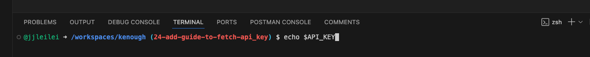

## Lesson 2: HTTP and Postman

### Prerequisites
- Create a free Postman account: https://www.postman.com/postman-account/

### Self-Learning Resources
- Http Fundamentals in 10 Minutes: https://www.youtube.com/watch?v=qv5-5hhsKpE
- Postman Beginner's Course - API Testing: https://www.youtube.com/watch?v=VywxIQ2ZXw4 (Two Units, the first unit should be enough)
- List of Public APIs: https://github.com/public-apis/public-apis

### API vs Webpage 
- Webpage responses an html file while Api responses other formats(json, xml, ...).
- A webpage is meant for human interaction while APIs provide a way for software applications to communicate and interact with each other directly.

### OpenAPI vs Swagger vs Postman
| Tool        | Purpose                     | Primary Use Case                                  | Format                 | Example                                                                                  |
|-------------|-----------------------------|---------------------------------------------------|------------------------|------------------------------------------------------------------------------------------|
| **OpenAPI** | Specification               | Documenting API structure and behavior            | YAML/JSON              | https://payment-incubator.apps.dev.cborbit.dev/swagger.json           |
| **Swagger** | Toolset (built on OpenAPI)  | Designing, documenting, and testing APIs visually | Interactive UI, Codegen | https://payment-incubator.apps.dev.cborbit.dev/api-docs/                    |
| **Postman** | Testing and Development Tool | API testing, collaboration, and environment management | HTTP request builder, Collections  | [View Documentation](payment_incubator.postman_collection.json)                |

### Fetch API_KEY
- Open New Terminal
- Type in `echo $API_KEY`

