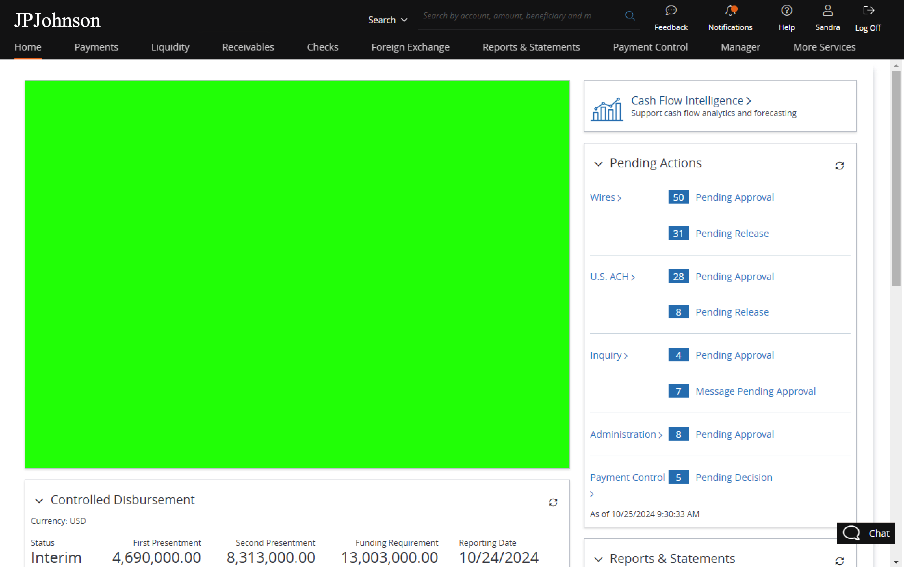

# Lesson 3: Building the UI with Svelte/Sveltekit, Debugging with Chrome Devtools

## Introduction

This is a very simple sveltekit project. For this exercise, the only thing you need to modify is the src/routes/+page.svelte. 

## Building the project

```bash
# To install project dependencies, please do:
npm install
```

## Running the app

```
# To run app, please do:
npm run dev
```

## Self-Learning Resources

- **HTML & CSS Book**: https://learning.oreilly.com/library/view/html-css/9781118206911/
- **Javascript Book**: https://learning.oreilly.com/library/view/javascript-the-definitive/9781491952016/
- **Chrome devtool**: https://www.youtube.com/watch?v=x4q86IjJFag
- **Svelte**: https://www.youtube.com/watch?v=zojEMeQGGHs&list=PL4cUxeGkcC9hlbrVO_2QFVqVPhlZmz7tO&ab_channel=NetNinja
- **Sveltekit**: https://www.youtube.com/watch?v=9OlLxkaeVvw&list=PL4cUxeGkcC9hpM9ARM59Ve3jqcb54dqiP&index=1&ab_channel=NetNinja

## Exercise

**Background**: The auto-cash sweep feature for client operating accounts has been implemented, allowing clients to automatically transfer idle cash into investment options that generate returns. However, adoption of this feature has remained low, suggesting that clients may be unaware of its benefits or do not fully understand the potential financial impact of not activating it.

**Objective**: The goal of this RFC is to propose strategies to raise awareness and drive adoption of the auto-cash sweep feature by enhancing the user experience within the bank portal. This should include an intuitive, data-driven interface that clearly communicates the financial advantage of enabling cash sweep.

